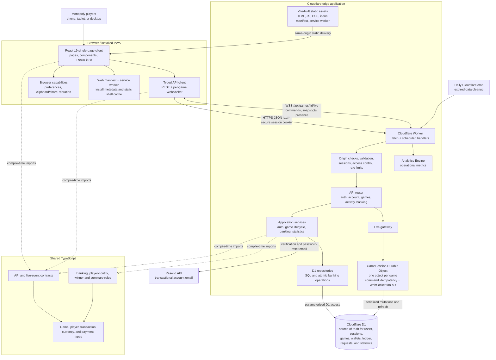

# Monopoly Bank

A responsive English/Ukrainian banking companion for an in-person Monopoly game. It stores games, player wallets, and explicit banking history in Cloudflare D1; it does not implement board or game-engine rules. The UI language switch is available in the header and the preference is retained in the browser.

## Open source

Monopoly Bank is licensed under the [MIT License](LICENSE). Contributions are
welcome; see [CONTRIBUTING.md](CONTRIBUTING.md). For security vulnerabilities,
follow the private reporting process in [SECURITY.md](SECURITY.md) rather than
opening a public issue.

## Project architecture

The client is a player at the physical Monopoly table using a modern phone, tablet, or desktop browser. The same React application serves owners, registered players, and guests; authorization is enforced by the Worker. It can run in a browser tab or as a standalone PWA through [`public/manifest.webmanifest`](public/manifest.webmanifest). There is no native mobile client or separate administration application.



### Runtime flow

1. Cloudflare serves the Vite-built React application and PWA files. The service worker caches only the static shell; API calls, authenticated data, banking mutations, invitations, and WebSocket traffic are never cached.
2. The React client calls same-origin `/api/*` endpoints using the shared request/response contracts. The Worker applies origin checks, input validation, authentication, authorization, and rate limits before invoking application services.
3. Live game-state and banking mutations are routed through the per-game `GameSession` Durable Object. It serializes commands, protects retries with command IDs, persists through D1-backed services, and broadcasts versioned snapshots to connected clients over WebSockets.
4. D1 is the durable source of truth. Durable Object storage coordinates the live session but does not replace the persisted game, wallet, transaction, or statistics records.
5. The Worker emits operational events to Analytics Engine, uses Resend for configured account emails, and runs daily cleanup through a scheduled Cloudflare trigger.

### Components and tools

| Area | Components and tools | Responsibility |
| --- | --- | --- |
| Client | React 19, React DOM, TypeScript, HTML/CSS | Single responsive English/Ukrainian UI for owners, registered players, and guests. |
| PWA | Web App Manifest, service worker, Cache Storage | Standalone installation, icons/theme metadata, update handling, and an offline static shell. |
| Client communication | Fetch API, WebSocket API, shared TypeScript contracts | Typed REST operations plus real-time per-game updates and commands. |
| Edge backend | Cloudflare Workers, API router, scheduled handler | API entry point, security boundary, dependency wiring, error mapping, and cleanup jobs. |
| Real time | Cloudflare Durable Objects, WebSocket Hibernation API | One coordinator per game for ordered/idempotent mutations, presence, and fan-out. |
| Persistence | Cloudflare D1, SQL migrations, repository layer | Authoritative accounts, access, games, balances, transaction ledger, payment requests, and statistics. |
| Observability and email | Cloudflare Analytics Engine, Resend API | Operational metrics and transactional verification/password-reset email. |
| Shared code | `shared/contracts`, `shared/domain`, `shared/types` | Stable API/live contracts and financial rules used across browser and Worker code. |
| Build and local development | npm, Vite 8, Cloudflare Vite plugin, TypeScript 6, Wrangler | Runs the integrated client/Worker locally, builds assets and Worker code, manages D1, and deploys. |
| Quality | ESLint, Vitest, Playwright, Node.js validation/load/restore scripts | Static checks, unit/contract tests, D1 migration checks, browser tests, load tests, and operational rehearsals. |
| Delivery | GitHub Actions, Wrangler | Validates pull requests and deploys isolated development, staging, and production environments with migrations. |

### Repository map

| Path | Role |
| --- | --- |
| `src/` | React application, pages, reusable UI, localization, browser utilities, and the typed API client. |
| `public/` | PWA manifest, service worker, favicon, and install icons copied as static assets. |
| `shared/` | Contracts, domain rules, and types shared by the client and Worker. |
| `worker/` | Worker entry point, API routing/validation, services, D1 repositories, security, metrics, email integration, and the Durable Object. |
| `migrations/` | Ordered D1 schema migrations and database constraints. |
| `scripts/` | Deployment preparation, migration checks, smoke/load tests, and restore rehearsal. |
| `e2e/` | Playwright production-pyramid browser scenarios. |
| `.github/workflows/` | CI plus development, staging, and production delivery workflows. |

UI work is governed by the canonical [UI design system](docs/ui-design-system.md).
Current CSS and screenshots describe builds; they do not define a separate
design contract.

The implemented visual styles are `classic-bank` and `liquid-glass`. Both
support light, dark, and system colour-mode preferences independently. Visual
styles are registry-based and may provide an isolated optional effect layer, so
future roadmap concepts such as Minimal Finance or others can be added without
modifying business pages. The canonical UI contract, including the Liquid Glass
effect and reduced-motion rules, is [the UI design system](docs/ui-design-system.md).

## Database setup

`wrangler.jsonc` contains the production `MONOPOLY_BANK_DB` binding and the separate `monopoly-bank-dev` development database. A D1 database is created only once. If Wrangler reports that a database name already exists, that is expected: verify and reuse it instead of creating another database.

```bash
# Verify an existing database in the authenticated Cloudflare account.
npx wrangler d1 info monopoly-bank-dev

# Create a database only when `d1 info` reports that it does not exist.
npx wrangler d1 create monopoly-bank-dev --location eeur
```

If a new **production** D1 database is intentionally created, update the production binding's `database_id` in `wrangler.jsonc` before applying remote migrations or deploying. Never point the production Worker at `monopoly-bank-dev`.

## Local development

```bash
npm install
npx wrangler d1 migrations apply MONOPOLY_BANK_DB --local
npm run dev
```

The Vite Cloudflare plugin runs the React UI and Worker together. Local D1 data is held in `.wrangler/`, which is ignored by Git.

### Transactional email (temporarily disabled)

Account registration and sign-in use a nickname and password only; email is not collected. Email verification and password reset are temporarily hidden until transactional email is configured. The Resend setup below is retained for re-enabling those delivery flows later.

- `RESEND_API_KEY` — a Resend API key allowed to send from the configured domain;
- `RESEND_FROM_EMAIL` — a sender address on a verified Resend domain, for example `Monopoly Bank <accounts@example.com>`;
- `APP_ORIGIN` — the public HTTPS origin used in email links, without a trailing path.

Set each value against the intended Worker configuration, for example:

```bash
npx wrangler secret put RESEND_API_KEY
npx wrangler secret put RESEND_FROM_EMAIL
npx wrangler secret put APP_ORIGIN
```

Development and staging deployments must pass their generated `--config` file to the same commands. Release workflows now stop before deployment when any required email secret is absent.

## Validation

```bash
npm test
npm run lint
npm run build
```

`npm run build` includes the TypeScript project build; there is no separate typecheck script.

## Lobby invitations

Lobby owners create a secure invitation link from the lobby screen. The link contains a random bearer token, never the game password; only its SHA-256 hash is persisted. Tokens expire after seven days and cannot join a game after the lobby has started.

The Invite dialog can copy the link or open the device's default mail client with a populated invitation. No email address is sent to or stored by Monopoly Bank. SMS/phone delivery is not configured in the current Worker because there is no SMS provider binding; add a provider-specific Worker binding and delivery service before offering server-sent SMS.

## API errors and request correlation

Every API response includes `X-Request-ID`. Error responses use one contract: `{ "error": { "code", "message", "requestId", "details?" } }`. Codes are stable machine identifiers (for example `VALIDATION_ERROR`, `UNAUTHORIZED`, `INSUFFICIENT_FUNDS`, `GAME_FINISHED`, and `INTERNAL_ERROR`); the HTTP status carries the error category. `details` is present only for safe, structured information such as an invalid field or a required balance.

The same request ID is included in structured Worker logs. Client responses never include stacks, D1/SQL diagnostics, credentials, cookies, or other internals. For a 5xx, use the request ID to find the server-side log, where the original cause chain is retained and sensitive fields are redacted.

## Production deployment

After the database setup above:

```bash
npx wrangler d1 migrations apply MONOPOLY_BANK_DB --remote
npm run deploy
```

Run the migration command before every deployment that introduces a new file in `migrations/`. Do not commit account credentials or Cloudflare API tokens.

## GitHub Actions deployments

### Cloudflare credentials

Create a Cloudflare API token scoped to the account that owns the Worker. It needs `Workers Scripts: Edit` and `D1: Edit` account permissions. Copy the account ID from the Cloudflare dashboard.

In GitHub, open **Settings → Environments** and create both `development` and `production`. Add these environment secrets to each environment:

- `CLOUDFLARE_API_TOKEN` — the Cloudflare API token;
- `CLOUDFLARE_ACCOUNT_ID` — the Cloudflare account ID.

Environment secrets are separate: adding credentials to `production` does not make them available to `development`. Do not store these values in source code or as plain GitHub variables.

### Automatic development deployment

Pushes to `dev` deploy automatically to the separate `monopoly-bank-dev` Worker and D1 database. First verify that the database exists; reuse it if it does:

```bash
npx wrangler d1 info monopoly-bank-dev
```

Only if that command says the database does not exist, create it once:

```bash
npx wrangler d1 create monopoly-bank-dev --location eeur
```

- secrets: `CLOUDFLARE_API_TOKEN`, `CLOUDFLARE_ACCOUNT_ID`;
- optionally, the `CLOUDFLARE_DEV_D1_DATABASE_NAME` variable when the database is not named `monopoly-bank-dev`.

The workflow resolves the development D1 database UUID from its name, so no database ID needs to be stored in GitHub. The database must identify the development database, not `monopoly-bank`. Pending migrations are applied to that development database before each deployment.

After committing the workflow to `dev`, push or merge a change into `dev`. The `CI` workflow validates the revision, resolves the existing development D1 database, applies migrations, and deploys `monopoly-bank-dev`. Do not apply the same migrations manually immediately before this workflow; it applies pending migration files safely.

Use the GitHub Actions path for development deployments: it builds the separate development Worker configuration, applies pending migrations to `monopoly-bank-dev`, and avoids accidentally deploying development changes to production.

### Manual production release

Production releases are manual only:

1. Merge the release PR from `dev` into `main` after its required checks and review.
2. Open **Actions → Deploy → Run workflow**.
3. Select `main`, enable `confirm_production_release`, and run the workflow.

The workflow re-runs lint, tests, and the production build, applies production D1 migrations, and then deploys `monopoly-bank`. Configure required reviewers on the GitHub `production` environment if an additional approval gate is desired.
