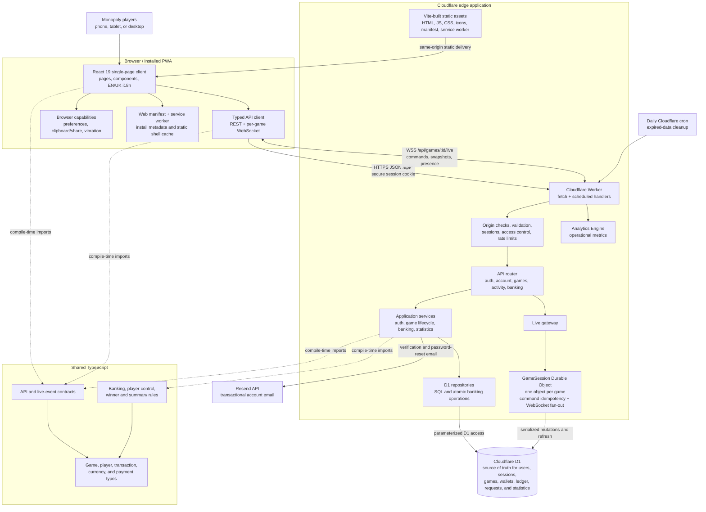

# Architecture

This page describes how the browser client, the shared TypeScript packages and the Cloudflare edge application fit together. It is the reference behind the one-paragraph summary in the repository [README](../README.md).

The client is a player at the physical Monopoly table using a modern phone, tablet, or desktop browser. The same React application serves owners, registered players, and guests; authorization is enforced by the Worker. It can run in a browser tab or as a standalone PWA through [`public/manifest.webmanifest`](../public/manifest.webmanifest). There is no native mobile client or separate administration application.

## Runtime flow

1. Cloudflare serves the Vite-built React application and PWA files. The service worker caches only the static shell; API calls, authenticated data, banking mutations, invitations, and WebSocket traffic are never cached.
2. The React client calls same-origin `/api/*` endpoints using the shared request/response contracts. The Worker applies origin checks, input validation, authentication, authorization, and rate limits before invoking application services.
3. Live game-state and banking mutations are routed through the per-game `GameSession` Durable Object. It serializes commands, protects retries with command IDs, persists through D1-backed services, and broadcasts versioned snapshots to connected clients over WebSockets.
4. D1 is the durable source of truth. Durable Object storage coordinates the live session but does not replace the persisted game, wallet, transaction, or statistics records.
5. The Worker emits operational events to Analytics Engine, uses Resend for configured account emails, and runs daily cleanup through a scheduled Cloudflare trigger.

## Components and tools

| Area                        | Components and tools                                                | Responsibility                                                                                                  |
| --------------------------- | ------------------------------------------------------------------- | --------------------------------------------------------------------------------------------------------------- |
| Client                      | React 19, React DOM, TypeScript, HTML/CSS                           | Single responsive English/Ukrainian UI for owners, registered players, and guests.                              |
| PWA                         | Web App Manifest, service worker, Cache Storage                     | Standalone installation, icons/theme metadata, update handling, and an offline static shell.                    |
| Client communication        | Fetch API, WebSocket API, shared TypeScript contracts               | Typed REST operations plus real-time per-game updates and commands.                                             |
| Edge backend                | Cloudflare Workers, API router, scheduled handler                   | API entry point, security boundary, dependency wiring, error mapping, and cleanup jobs.                         |
| Real time                   | Cloudflare Durable Objects, WebSocket Hibernation API               | One coordinator per game for ordered/idempotent mutations, presence, and fan-out.                               |
| Persistence                 | Cloudflare D1, SQL migrations, repository layer                     | Authoritative accounts, access, games, balances, transaction ledger, payment requests, and statistics.          |
| Observability and email     | Cloudflare Analytics Engine, Resend API                             | Operational metrics and transactional verification/password-reset email.                                        |
| Shared code                 | `shared/contracts`, `shared/domain`, `shared/types`                 | Stable API/live contracts and financial rules used across browser and Worker code.                              |
| Build and local development | npm, Vite 8, Cloudflare Vite plugin, TypeScript 6, Wrangler         | Runs the integrated client/Worker locally, builds assets and Worker code, manages D1, and deploys.              |
| Quality                     | ESLint, Vitest, Playwright, Node.js validation/load/restore scripts | Static checks, unit/contract tests, D1 migration checks, browser tests, load tests, and operational rehearsals. |
| Delivery                    | GitHub Actions, Wrangler                                            | Validates pull requests and deploys isolated development, staging, and production environments with migrations. |

## Related documents

- [Real-time Durable Objects](realtime-durable-objects.md) — the `GAME_SESSIONS` binding and its deployment rules.
- [API errors and request correlation](api-errors.md) — the error envelope every `/api/*` route returns.
- [Security threat model](security-threat-model.md) — trust boundaries and the authorization matrix.
